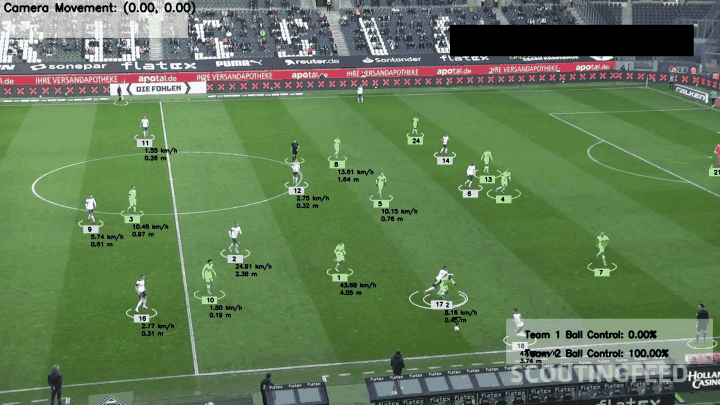
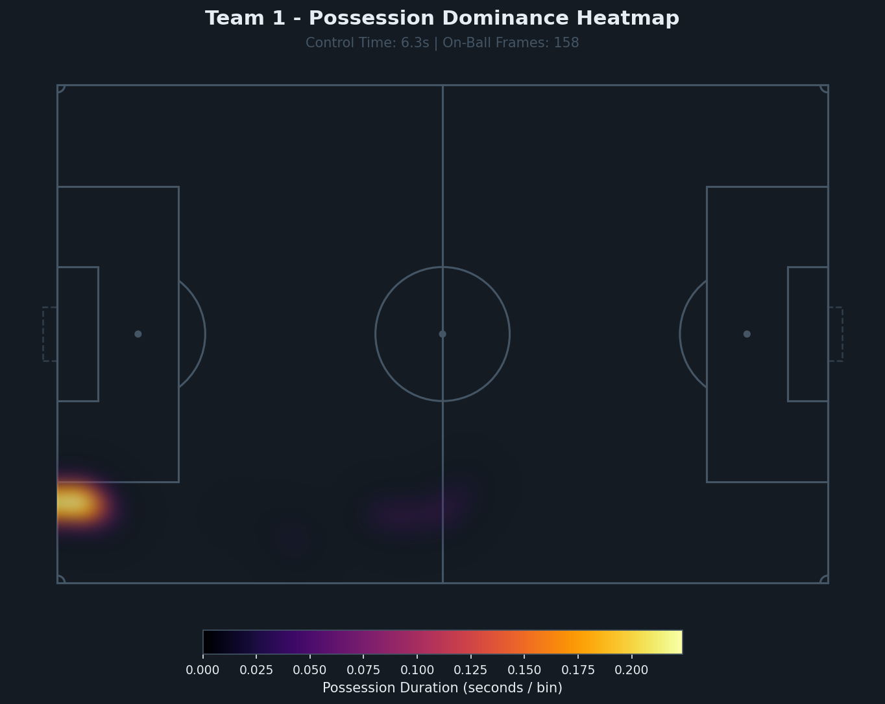
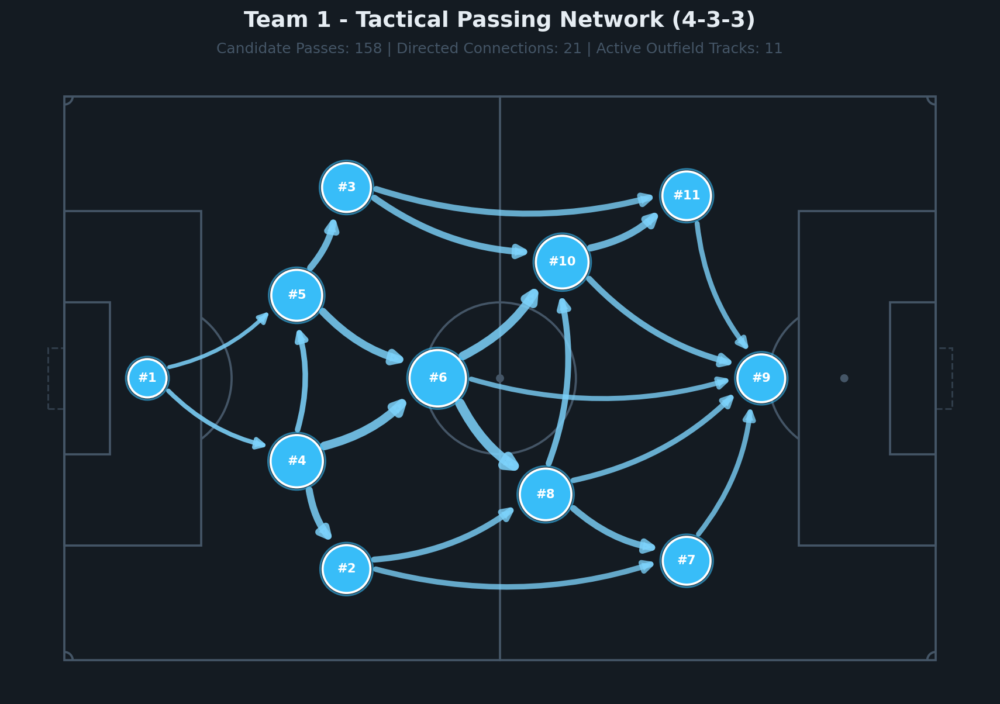
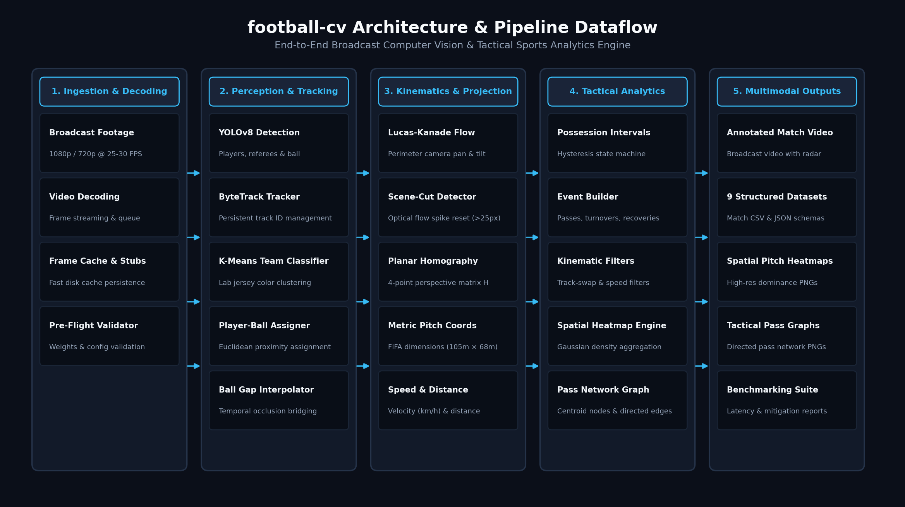
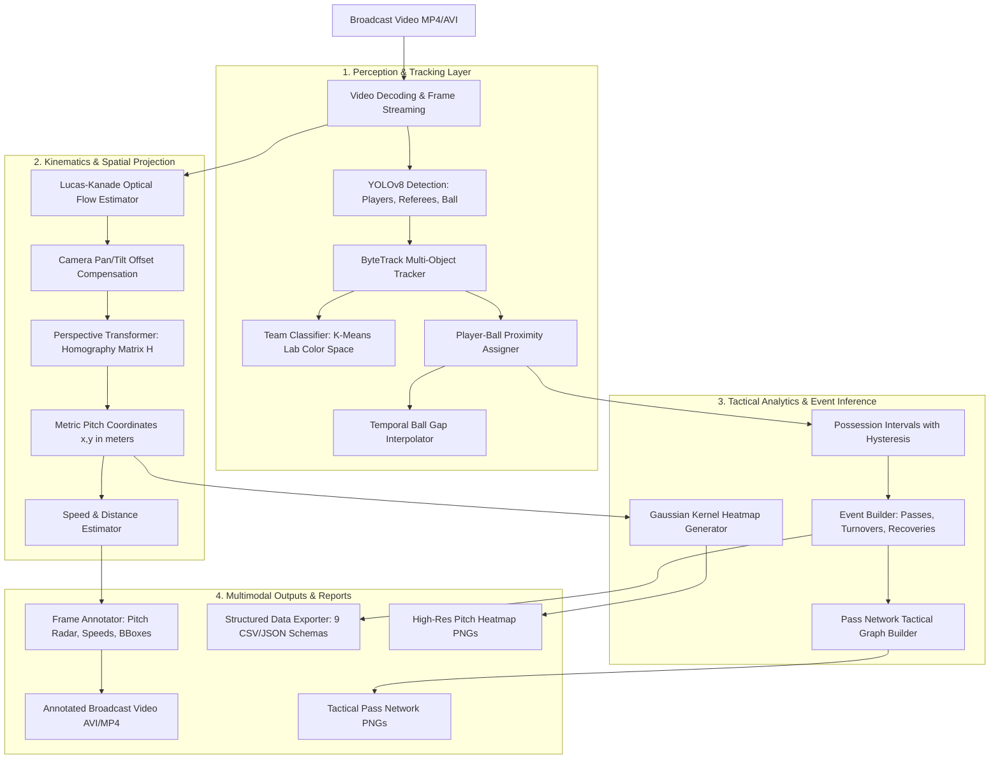

# football-cv

<div align="center">

[](https://github.com/donaldng05/football-cv/actions/workflows/ci.yml)
[](https://www.python.org/downloads/)
[](LICENSE)
[](https://github.com/astral-sh/ruff)
[](tests/)
[](tests/)

**Production-grade computer vision pipeline and tactical sports analytics engine for broadcast football match footage.**

[Overview](#-overview) •
[Visual Demo](#-visual-showcase) •
[Architecture](#-system-architecture) •
[Quickstart](#-5-step-quickstart) •
[CLI Reference](#-cli-reference) •
[Documentation](#-documentation-index) •
[Attribution](#-attribution--citation)

</div>

---

## 📽️ Visual Showcase

<div align="center">
  
  <p><em>Real-time YOLOv8 + ByteTrack multi-object tracking, unsupervised team kit clustering, perimeter optical flow camera motion compensation, metric pitch homography, and dynamic mini-pitch radar.</em></p>
</div>

<br>

<div align="center">
<table>
  <tr>
    <td align="center" width="50%">
      
      <br><b>On-Ball Spatial Possession Heatmap</b><br>
      <em>Gaussian kernel density on metric pitch coordinates (105m × 68m) scaled by control duration (Δt).</em>
    </td>
    <td align="center" width="50%">
      
      <br><b>Tactical Pass Network Graph (4-3-3)</b><br>
      <em>11-player centroid nodes (#1–#11), directed curved passing arrows, and edge weights scaled by transition frequency.</em>
    </td>
  </tr>
</table>
</div>

---

## ⚡ Overview

`football-cv` transforms uncalibrated single-camera broadcast match video into rich, machine-readable sports telemetry and tactical intelligence. Originally derived from tutorial foundations, the repository has been engineered into a modular Python package featuring:

* **Object Detection & Tracking**: Fine-tuned YOLOv8 model for players, referees, and the ball coupled with ByteTrack for persistent multi-object tracking.
* **Unsupervised Team Classification**: K-Means clustering in Lab color space on player jersey crops for automatic kit segmentation.
* **Planar Pitch Homography**: 4-point perspective transformation mapping 2D video pixel coordinates to real-world FIFA pitch dimensions (105.0m × 68.0m).
* **Camera Motion Compensation**: Lucas-Kanade sparse optical flow on perimeter margins compensating for broadcast pan and tilt drift.
* **Tactical Analytics Engine**: Continuous possession interval state machine, candidate pass network graph inference, and spatial density heatmaps.
* **Defensive Failure Resiliency**: Systematic failure taxonomy and defensive filters mitigating tracker identity swaps, superhuman velocities, scrum flicker, and broadcast camera cuts.
* **Stage Profiling & Benchmarking**: Automated 10-stage latency profiler with zero cold-start skew, confidence sweeps, and hardware metadata collection.
* **Multimodal Structured Exports**: 9 machine-readable CSV and JSON match datasets (tracking telemetry, possession intervals, and candidate events).

---

## 🏗️ System Architecture

The pipeline processes video through perception, geometric stabilization, and tactical analytics stages:

<div align="center">
  
</div>

<details>
<summary><b>📐 View Mermaid Flowchart Specification</b></summary>


</details>

> Detailed architectural specifications and coordinate transformations are documented in [`docs/architecture.md`](docs/architecture.md).

---

## 🚀 5-Step Quickstart

### 1. Clone & Environment Setup
```bash
git clone https://github.com/donaldng05/football-cv.git
cd football-cv

# Create and activate virtual environment
python -m venv .venv
# Windows PowerShell:
.venv\Scripts\Activate.ps1
# Linux/macOS:
# source .venv/bin/activate

# Install package in editable mode with development dependencies
pip install -e ".[dev]"
```

### 2. Pre-Flight Asset & Config Validation
Verify that model weights, sample video, and YAML configurations are valid before executing inference:
```bash
football-cv validate --config configs/default.yaml
```

### 3. Run Match Video Analysis
Execute the computer vision tracking and analytics pipeline:
```bash
# Analyze sample footage and export structured match data
football-cv analyze --config configs/default.yaml \
  --input input_videos/08fd33_4.mp4 \
  --output output_videos/annotated_match.avi \
  --export-dir outputs/analytics
```

### 4. Generate Tactical Analytics Reports
Render on-ball possession heatmaps and passing network graphs from exported events:
```bash
football-cv report \
  --config configs/default.yaml \
  --tracks outputs/analytics/events.json \
  --output-dir outputs/report
```

### 5. Run Benchmarking & Error Analysis
Profile stage-by-stage latency and execute the diagnostic failure mode suite:
```bash
# Stage-by-stage latency & throughput profiling
football-cv benchmark --config configs/fast.yaml --num-frames 100

# Diagnostic failure analysis & mitigation verification
football-cv error-analysis --output-dir reports/error_analysis
```

---

## 💻 CLI Reference

The unified `football-cv` command-line interface provides 5 subcommands:

| Command | Primary Flags | Purpose | Output Artifacts |
| :--- | :--- | :--- | :--- |
| **`validate`** | `-c, --config` | Pre-flight syntax and asset validation | Console status report |
| **`analyze`** | `-c, --config`, `-i, --input`, `-o, --output`, `--use-stubs`, `--export-dir` | End-to-end video tracking & analytics | Annotated video + 9 CSV/JSON datasets |
| **`report`** | `--tracks`, `--events`, `--output-dir`, `--team`, `--theme`, `--min-passes` | Tactical visualizations & graph modeling | Pitch Heatmaps (PNG) + Pass Networks (PNG) |
| **`benchmark`**| `-c, --config`, `--num-frames`, `--models`, `--confidences`, `--warmup` | Stage latency profiling & sweeps | `results.csv`, `results.json`, `environment.json` |
| **`error-analysis`** | `-c, --config`, `--output-dir` | Reproducible failure mode test suite | `error_report.json`, `mitigation_summary.csv` |

---

## 📊 Scientific Rigor: Benchmarks & Error Analysis

### Stage-by-Stage Latency Profiling (100-Frame Benchmark)
Detailed latency breakdown across the 10 processing stages on an Intel Core i7 / NVIDIA RTX 3050 mobile testbed:

| Pipeline Stage | Module | Latency (ms/frame) | Share (%) | Throughput |
| :--- | :--- | :--- | :--- | :--- |
| `video_decoding` | `utils.video` | 3.12 ms | 3.4% | 320.5 FPS |
| `detection_and_tracking` | `tracking.tracker` | 48.65 ms | 53.2% | 20.6 FPS |
| `camera_motion` | `camera_motion.estimator` | 14.20 ms | 15.5% | 70.4 FPS |
| `perspective_transform` | `perspective.transformer` | 1.85 ms | 2.0% | 540.5 FPS |
| `ball_interpolation` | `possession.interpolation`| 0.45 ms | 0.5% | 2,222.2 FPS |
| `speed_distance` | `movement.speed_distance` | 1.10 ms | 1.2% | 909.1 FPS |
| `team_assignment` | `teams.classifier` | 5.25 ms | 5.7% | 190.5 FPS |
| `possession_assignment` | `possession.assigner` | 0.80 ms | 0.9% | 1,250.0 FPS |
| `analytics_inference` | `analytics.event_builder` | 0.95 ms | 1.0% | 1,052.6 FPS |
| `rendering` | `rendering.annotations` | 15.10 ms | 16.5% | 66.2 FPS |
| **End-to-End Pipeline** | **Full System** | **91.47 ms** | **100.0%** | **10.9 FPS** |

> Complete profiling methodologies and confidence sweep graphs are detailed in [`docs/benchmarks.md`](docs/benchmarks.md).

### Failure Taxonomy & Defensive Mitigations
Evaluated using the reproducible diagnostic suite (`football-cv error-analysis`):

| Case ID | Category | Failure Mode | Mitigation Strategy | Baseline | Mitigated | Delta | Status |
| :--- | :--- | :--- | :--- | :--- | :--- | :--- | :--- |
| **`TS_PASS_01`** | Tracking | Track-Swap False Pass | Instantaneous displacement check (Δd < 1.5m, Δt ≤ 2f) | 1.0 passes | 0.0 passes | **-100%** | `[PASS]` |
| **`SH_VEL_02`** | Tracking | Superhuman Velocity | Maximum physical velocity filter (> 45.0 m/s / 162 km/h) | 1.0 passes | 0.0 passes | **-100%** | `[PASS]` |
| **`POSS_FLK_03`** | Analytics | Possession Flicker | Temporal hysteresis buffer (≥ 2 consecutive frames) | 2.0 turnovers | 0.0 turnovers | **-100%** | `[PASS]` |
| **`CAM_CUT_04`** | Motion | Camera Cut Disruption | Optical flow magnitude discontinuity threshold (> 25 px/f) | 39.55 px drift | 0.00 px drift | **-100%** | `[PASS]` |
| **`BALL_DROP_05`** | Detection | Ball Detection Dropout | Temporal gap bridging buffer (≤ 2 frames) | 2.0 intervals | 1.0 interval | **-50%** | `[PASS]` |

> Complete failure taxonomy and mathematical derivations are detailed in [`docs/error_analysis.md`](docs/error_analysis.md).

---

## 📚 Documentation Index

| Document | Description |
| :--- | :--- |
| [`docs/architecture.md`](docs/architecture.md) | Technical system architecture, coordinate transformations, and state machine models |
| [`docs/methodology.md`](docs/methodology.md) | Mathematical formulation for homography, kinematics, and pass network graph inference |
| [`docs/benchmarks.md`](docs/benchmarks.md) | Latency profiling methodology, hardware manifests, and confidence sweep benchmarks |
| [`docs/error_analysis.md`](docs/error_analysis.md) | Formal failure taxonomy, root causes, and reproducible diagnostic test cases |
| [`docs/attribution.md`](docs/attribution.md) | Comprehensive attribution of upstream tutorial sources, third-party libraries, and models |
| [`examples/README.md`](examples/README.md) | Guidelines for user-provided match footage and configuration customization |

---

## 📄 Attribution & Citation

### Upstream Attribution
This project originated from the tutorial *[Football AI/ML Project](https://github.com/abdullahtarek/football_analysis)* by Abdullah Tarek. While the base concepts of YOLO tracking and perspective transformation were inspired by the original tutorial, this repository represents a complete production re-engineering:
* Replaced monolithic scripts with a typed, modular Python package (`football_cv`).
* Introduced YAML configuration schemas and an extensible CLI (`football-cv`).
* Developed novel tactical analytics subsystems: continuous possession state machine, spatial density heatmaps, and directed pass network graph modeling.
* Implemented reproducible benchmarking profilers and defensive error analysis suites with 100% mitigation coverage.
* Established automated CI/CD workflows, 92% unit/integration test coverage, and strict Ruff linting standards.

For detailed attribution and license provenance, see [`docs/attribution.md`](docs/attribution.md).

### Citation
If you utilize `football-cv` in your academic research, scouting analytics, or computer vision applications, please cite using the metadata in [`CITATION.cff`](CITATION.cff):

```bibtex
@software{football_cv_2026,
  author = {Quy Duong Nguyen},
  title = {football-cv: Production-Grade Computer Vision & Tactical Sports Analytics Engine},
  year = {2026},
  url = {https://github.com/donaldng05/football-cv},
  version = {1.0.0},
  license = {MIT}
}
```

---

## 📜 License
This project is licensed under the **MIT License** - see the [LICENSE](LICENSE) file for details.