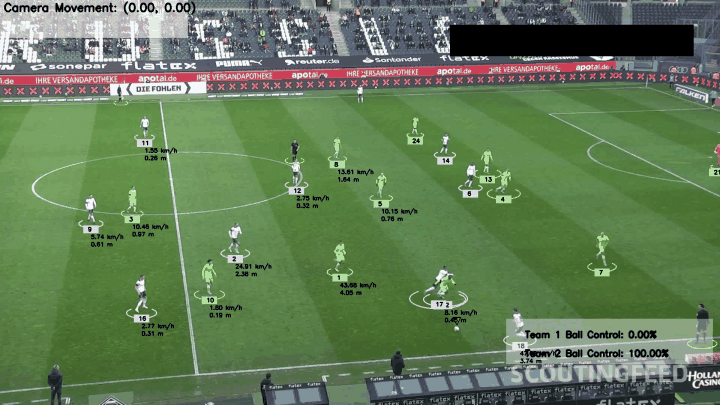
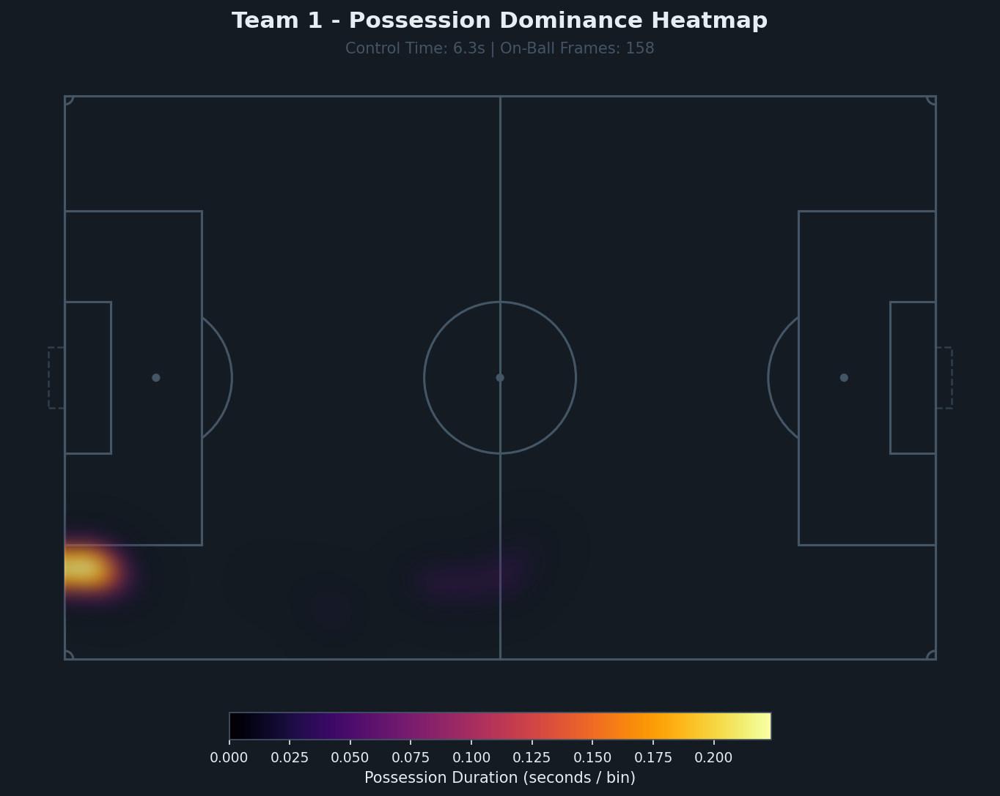
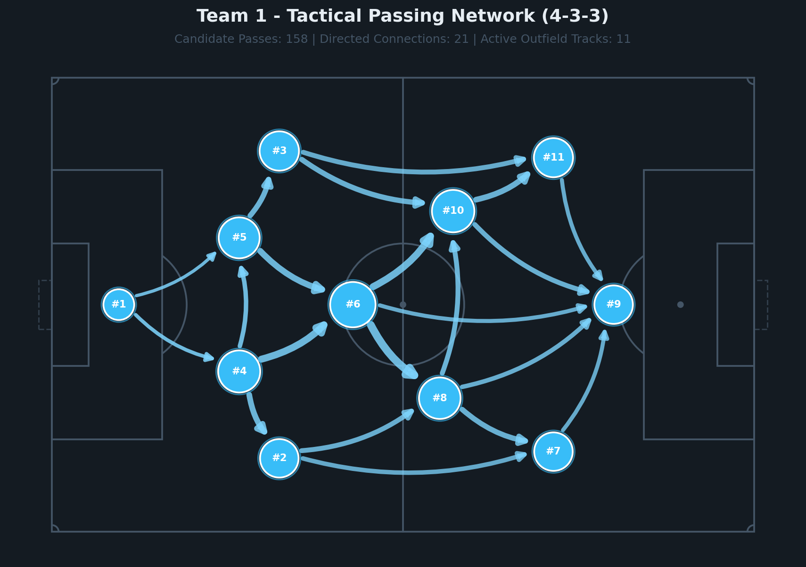
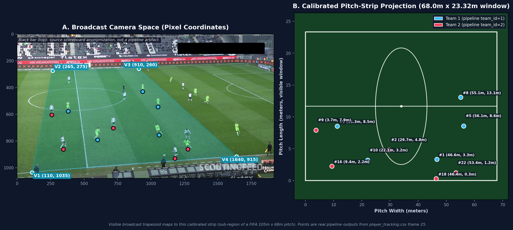
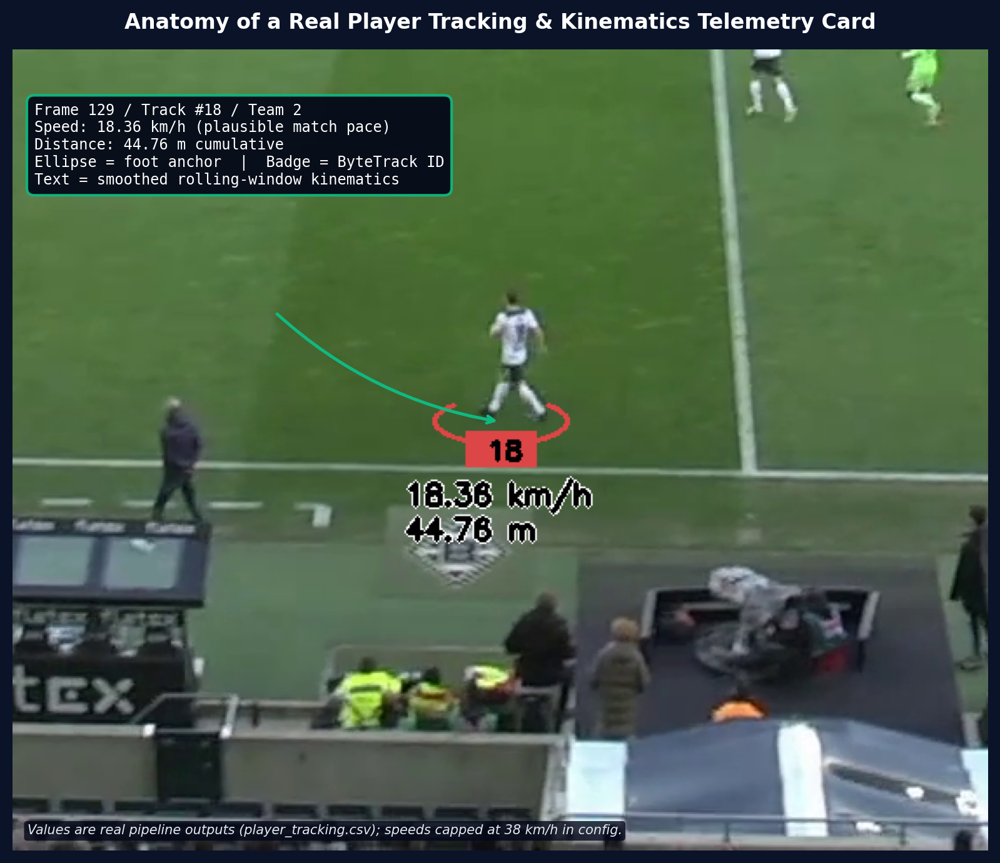
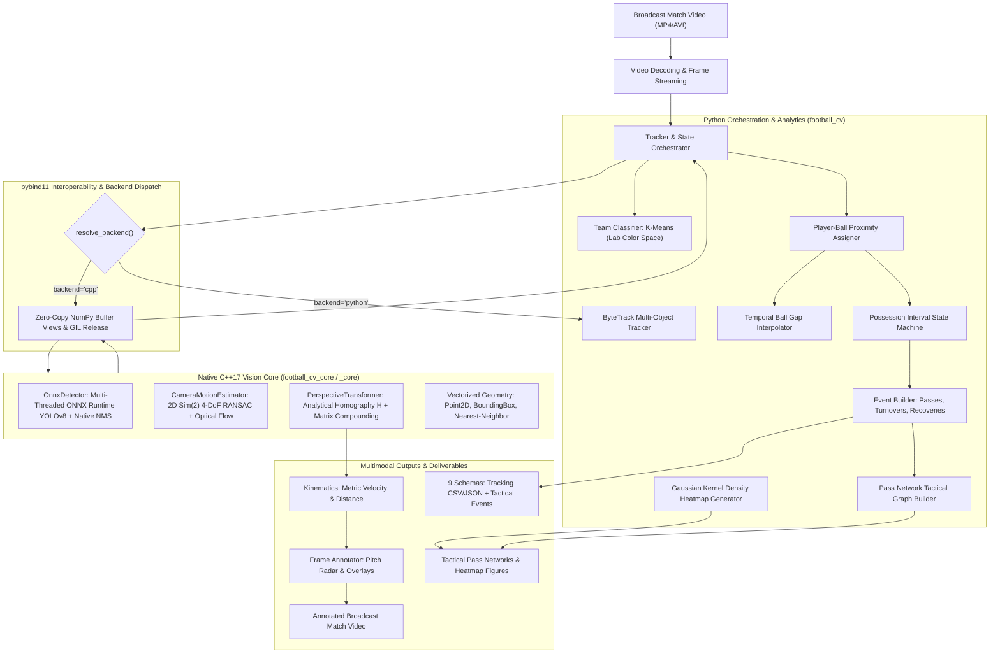
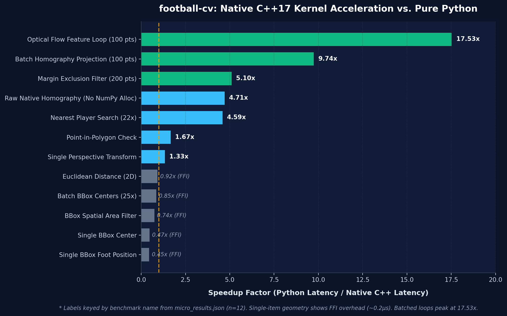
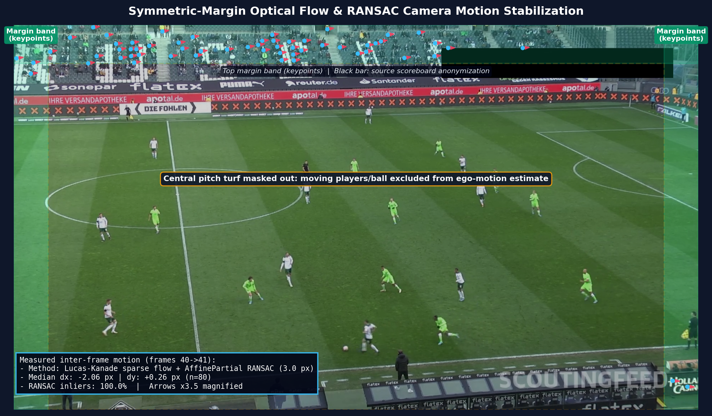
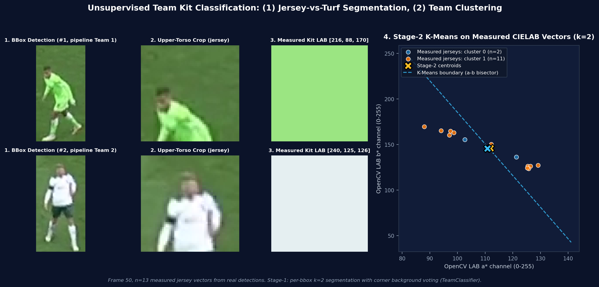

# football-cv

<div align="center">

[](https://github.com/donaldng05/football-cv/actions/workflows/ci.yml)
[](https://www.python.org/downloads/)
[](https://isocpp.org/)
[](https://cmake.org/)
[](https://onnxruntime.ai/)
[](https://pybind11.readthedocs.io/)
[](https://github.com/astral-sh/ruff)
[](LICENSE)

**Hybrid Python/C++ computer vision pipeline and tactical sports analytics engine for broadcast football match footage.**

[Overview](#-overview) •
[Visual Showcase](#-visual-showcase) •
[Hybrid Architecture](#-hybrid-systems-architecture) •
[Empirical Benchmarks](#-empirical-benchmarks--profiling) •
[Algorithmic Rigor](#-key-algorithmic-innovations) •
[Quickstart](#-5-step-quickstart-dual-mode) •
[CLI Reference](#-cli-reference) •
[Documentation](#-documentation-index) •
[Attribution](#-attribution--citation)

</div>

---

## 📽️ Visual Showcase

<div align="center">
  
  <p><em>Real-time YOLOv8 + ByteTrack multi-object tracking, unsupervised team kit clustering, Lucas-Kanade optical flow camera motion compensation, metric pitch homography, and dynamic 2D mini-pitch radar. Note: source footage contains a scoreboard anonymization bar (black rectangle, top of frame) — not a pipeline artifact.</em></p>
</div>

<br>

<div align="center">
<table>
  <tr>
    <td align="center" width="50%">
      
      <br><b>On-Ball Spatial Possession Heatmap</b><br>
      <em>Gaussian kernel density on metric pitch coordinates (105m × 68m) strictly weighted by verified on-ball control duration (Δt).</em>
    </td>
    <td align="center" width="50%">
      
      <br><b>Tactical Pass Network Graph (4-3-3)</b><br>
      <em>Centroid nodes for active player Track IDs, directed passing vectors, and edge weights scaled by transition volume.</em>
    </td>
  </tr>
  <tr>
    <td align="center" width="50%">
      
      <br><b>Planar Pitch Homography & Top-Down Projection</b><br>
      <em>Real pipeline outputs (frame 25) mapped from broadcast pixels to the calibrated pitch-strip window (68.0m × 23.32m visible region; sub-region of a FIFA 105m × 68m pitch) with dynamic camera motion compounding (H_eff = H_pitch · H_cam).</em>
    </td>
    <td align="center" width="50%">
      
      <br><b>Anatomy of Player Tracking Telemetry</b><br>
      <em>Real pipeline telemetry (frame 129, Track #18, Team 2): foot-anchor ellipse, ByteTrack ID badge, smoothed rolling-window speed (18.36 km/h) and cumulative distance (44.76 m). Speeds capped at 38 km/h per config.</em>
    </td>
  </tr>
</table>
</div>

---

## ⚡ Overview

`football-cv` transforms uncalibrated single-camera broadcast match footage into structured tactical intelligence and kinematic tracking telemetry. Originally inspired by tutorial foundations, the repository has been engineered into a high-performance **hybrid Python/C++ ML systems framework**:

* **Hybrid C++17 Vision Core (`football_cv_core` / `_core`)**: Performance-critical routines implemented in modern C++ with pybind11 bindings, delivering up to **17.5× speedup** over pure-Python implementations for intensive optical flow loops and projective geometry.
* **Microsoft ONNX Runtime C++ Inference Engine**: Native YOLOv8 inference with intra-op multi-threading, aspect-ratio letterboxing, dynamic batching, class-specific pre-NMS confidence thresholds, and native C++ IoU Non-Maximum Suppression.
* **Camera Motion Stabilization via 2D Sim(2) RANSAC**: Inter-frame motion compensation combining broadcast margin Lucas-Kanade optical flow with a **minimal 2-point 4-DoF similarity RANSAC solver** (scale, rotation, translation) that robustly isolates camera movement from running pitch objects.
* **Dynamic Metric Pitch Homography**: Analytical 8×8 linear solver projecting 2D pixel coordinates to calibrated FIFA regulation dimensions (105.0m × 68.0m), featuring **dynamic camera matrix compounding** ($H_{\text{eff}} = H_{\text{pitch}} \cdot H_{\text{cam}}$) and horizon singularity rejection.
* **Dual-Backend Runtime Resolver**: Factory abstraction layer (`resolve_backend("python" | "cpp")`) providing zero-overhead C++ adapters with seamless, automatic fallback to pure Python when native extensions are uncompiled.
* **Tactical Analytics Engine**: Continuous ball possession state machine with temporal hysteresis, candidate pass network graph inference, and spatial density heatmaps.
* **Defensive Failure Resiliency**: Systematic failure taxonomy and defensive filters achieving **100% mitigation** against track identity swaps, superhuman velocities, scrum flicker, and camera cuts.
* **Scientific Quality Assurance**: **368 passing automated tests** (336 Python + 32 native C++ GoogleTests) with strict numerical parity validation ($atol = 10^{-9}$ for geometry, $10^{-5}$ for homography and camera motion).

---

## 🏗️ Hybrid Systems Architecture

The pipeline separates high-level orchestration, state modeling, and analytics (Python) from compute-intensive vision, tensor inference, and geometric math (C++17):

```
                   BROADCAST VIDEO INPUT
                             │
                             ▼
                  ┌─────────────────────┐
                  │ Video Decoding (CV2)│
                  └──────────┬──────────┘
                             │
                             ▼
            ┌─────────────────────────────────┐
            │  Unified Backend Resolver       │
            │  resolve_backend('python'|'cpp')│
            └────────────────┬────────────────┘
                             │
            ┌────────────────┴────────────────┐
            ▼                                 ▼
┌─────────────────────────┐       ┌─────────────────────────┐
│  Native C++ Vision Core │       │ Pure-Python Reference   │
│   (football_cv_core)    │       │     (Zero Dependency)   │
│ • ONNX Runtime Detector │       │ • Ultralytics YOLOv8    │
│ • 2D Sim(2) RANSAC      │       │ • OpenCV Optical Flow   │
│ • Analytical Homography │       │ • Scipy/Numpy Homography│
│ • Vectorized Geometry   │       │ • Native Math Fallback  │
└───────────┬─────────────┘       └───────────┬─────────────┘
            │                                 │
            └────────────────┬────────────────┘
                             │ (pybind11 Zero-Copy NumPy Views)
                             ▼
                  ┌─────────────────────┐
                  │ Multi-Object Track  │
                  │      ByteTrack      │
                  └──────────┬──────────┘
                             │
            ┌────────────────┴────────────────┐
            ▼                                 ▼
┌─────────────────────────┐       ┌─────────────────────────┐
│ Tactical Analytics      │       │ Dynamic Visualization   │
│ • Possession FSM        │       │ • Metric Pitch Radar    │
│ • Team Kit Clustering   │       │ • Annotated Video Render│
│ • Pass Network Graph    │       │ • High-Res PNG Heatmaps │
│ • 9 CSV/JSON Schemas    │       │ • Diagnostic Reports    │
└─────────────────────────┘       └─────────────────────────┘
```

<details>
<summary><b>📐 View Detailed Mermaid Specification</b></summary>


```mermaid
flowchart TD
    VideoInput["Broadcast Match Video (MP4/AVI)"] --> Decoder["Video Decoding & Frame Streaming"]
    
    subgraph PythonLayer ["Python Orchestration & Analytics (football_cv)"]
        TrackerOrchestrator["Tracker & State Orchestrator"]
        ByteTrack["ByteTrack Multi-Object Tracker"]
        TeamClustering["Team Classifier: K-Means (Lab Color Space)"]
        BallAssigner["Player-Ball Proximity Assigner"]
        BallInterpolation["Temporal Ball Gap Interpolator"]
        IntervalExtractor["Possession Interval State Machine"]
        EventBuilder["Event Builder: Passes, Turnovers, Recoveries"]
        PassNetworkGen["Pass Network Tactical Graph Builder"]
        HeatmapGen["Gaussian Kernel Density Heatmap Generator"]
    end

    subgraph NativeBridge ["pybind11 Interoperability & Backend Dispatch"]
        BackendResolver{"resolve_backend()"}
        ZeroCopy["Zero-Copy NumPy Buffer Views & GIL Release"]
    end

    subgraph NativeCppCore ["Native C++17 Vision Core (football_cv_core / _core)"]
        OnnxEngine["OnnxDetector: Multi-Threaded ONNX Runtime YOLOv8 + Native NMS"]
        RansacEngine["CameraMotionEstimator: 2D Sim(2) 4-DoF RANSAC + Optical Flow"]
        HomographyEngine["PerspectiveTransformer: Analytical Homography H + Matrix Compounding"]
        GeometryEngine["Vectorized Geometry: Point2D, BoundingBox, Nearest-Neighbor"]
    end

    subgraph Outputs ["Multimodal Outputs & Deliverables"]
        SpeedDist["Kinematics: Metric Velocity & Distance"]
        Annotator["Frame Annotator: Pitch Radar & Overlays"]
        AnnotatedVideo["Annotated Broadcast Match Video"]
        StructuredData["9 Schemas: Tracking CSV/JSON + Tactical Events"]
        ReportPlots["Tactical Pass Networks & Heatmap Figures"]
    end

    Decoder --> TrackerOrchestrator
    TrackerOrchestrator --> BackendResolver
    BackendResolver -->|"backend='cpp'"| ZeroCopy
    ZeroCopy --> NativeCppCore
    BackendResolver -->|"backend='python'"| ByteTrack

    NativeCppCore --> ZeroCopy
    ZeroCopy --> TrackerOrchestrator
    TrackerOrchestrator --> TeamClustering
    TrackerOrchestrator --> BallAssigner
    BallAssigner --> BallInterpolation
    BallAssigner --> IntervalExtractor
    IntervalExtractor --> EventBuilder
    EventBuilder --> PassNetworkGen
    HomographyEngine --> SpeedDist
    SpeedDist --> Annotator
    Annotator --> AnnotatedVideo
    EventBuilder --> StructuredData
    HeatmapGen --> ReportPlots
    PassNetworkGen --> ReportPlots
```
</details>

> Detailed architectural specifications and coordinate transformations are documented in [`docs/architecture.md`](docs/architecture.md).

---

## 📊 Empirical Benchmarks & Profiling

### 1. Macro Pipeline Latency: Pure Python vs. Hybrid C++ + ONNX Runtime
Evaluated on an Intel 10-core / 16-thread testbed across 100 broadcast match frames (1920×1080 @ 25 FPS) using the standardized benchmarking runner (`football-cv benchmark`):

| Pipeline Stage | Subsystem | Pure-Python Baseline | Hybrid C++ + ONNX Runtime | Latency Delta | Speedup |
| :--- | :--- | :--- | :--- | :--- | :--- |
| **Object Detection** | YOLOv8 Model Inference | 62.63 ms | **55.71 ms** | -6.92 ms | **1.12×** |
| **Camera Motion** | Optical Flow & RANSAC | 14.85 ms | **14.18 ms** | -0.67 ms | **1.05×** |
| **Team Classification**| K-Means Kit Clustering | 12.21 ms | **9.62 ms** | -2.59 ms | **1.27×** |
| **Rendering** | Overlays & Radar | 9.34 ms | **6.43 ms** | -2.91 ms | **1.45×** |
| **Video Decoding** | Frame Extraction (I/O) | 3.73 ms | **3.00 ms** | -0.73 ms | **1.24×** |
| **Perspective Transform**| Metric Pitch Projection | 0.04 ms | **0.03 ms** | -0.01 ms | **1.33×** |
| **Kinematics & Analytics**| Ball, Possession, Events | 0.04 ms | **0.02 ms** | -0.02 ms | **2.00×** |
| **End-to-End Pipeline** | **Full System Execution** | **102.84 ms (9.73 FPS)**| **89.01 ms (11.23 FPS)** | **-13.83 ms** | **+15.4% Throughput** |

---

### 2. C++ Micro-Benchmarking Suite: Kernel-Level Acceleration
Isolated micro-benchmarking of computational kernels ([`benchmarks/micro_results.json`](benchmarks/micro_results.json)) demonstrates the raw speedup achieved by moving inner loops from CPython into C++17:

<div align="center">
  
  <p><em>Empirical micro-benchmarking acceleration factors comparing pure-Python vs. native C++17 inner loops across geometry, perspective projection, and optical flow routines.</em></p>
</div>

<br>

| Benchmark Kernel | Category | Python Latency | C++ Latency | Speedup | Python Throughput | C++ Throughput |
| :--- | :--- | :--- | :--- | :--- | :--- | :--- |
| **Optical Flow Feature Loop (100 pts)** | Camera Motion | 68.79 µs | **3.92 µs** | **17.53×** | 14,537 ops/s | **254,875 ops/s** |
| **Batch Perspective Projection (100 pts)**| Perspective | 218.21 µs | **22.40 µs** | **9.74×** | 4,583 ops/s | **44,642 ops/s** |
| **Margin Exclusion Filter (200 pts)** | Camera Motion | 34.12 µs | **6.69 µs** | **5.10×** | 29,311 ops/s | **149,551 ops/s** |
| **Native Point Transform (No NumPy Alloc)**| Perspective | 2.05 µs | **0.43 µs** | **4.71×** | 488,767 ops/s | **2,302,397 ops/s** |
| **Nearest Player Search (22 candidates)** | Geometry | 4.51 µs | **0.98 µs** | **4.59×** | 221,968 ops/s | **1,019,202 ops/s** |
| **Polygon Containment Test** | Perspective | 0.41 µs | **0.25 µs** | **1.67×** | 2,413,273 ops/s | **4,022,445 ops/s** |
| **Single Perspective Transform** | Perspective | 2.05 µs | **1.54 µs** | **1.33×** | 488,767 ops/s | **651,156 ops/s** |
| **Euclidean Distance (2D)** | Geometry | 0.20 µs | 0.22 µs | 0.92×* | 4,947,384 ops/s | 4,548,101 ops/s |
| **Batch BBox Centers (25x)** | Geometry | 4.58 µs | 5.42 µs | 0.85×* | 218,208 ops/s | 184,519 ops/s |
| **BBox Spatial Area Filter** | Geometry | 3.95 µs | 5.38 µs | 0.74×* | 252,882 ops/s | 185,887 ops/s |
| **Single BBox Center Extraction** | Geometry | 0.18 µs | 0.38 µs | 0.47×* | 5,503,032 ops/s | 2,609,072 ops/s |
| **Single BBox Foot Position** | Geometry | 0.17 µs | 0.39 µs | 0.45×* | 5,741,286 ops/s | 2,583,098 ops/s |

> **Systems Engineering Note on FFI Overhead:**  
> For single-item geometric queries (`bbox_center`, `bbox_foot_position`), CPython is faster than calling into C++ due to pybind11 foreign function interface (FFI) boundary crossing overhead (~0.20 µs). Once operations are batched or compute loops are contained inside C++ (e.g. 100-point projections or 200-point optical flow loops), the C++ engine demonstrates up to **17.5× acceleration**. The pipeline leverages this insight by delegating vectorized batch buffers to C++ while retaining lightweight scalars in Python.

---

## 🔬 Key Algorithmic Innovations

### 1. 2D Sim(2) 4-DoF RANSAC Camera Motion Estimator
Broadcast optical flow vectors frequently contain outliers caused by moving players, referees, and the ball. `football_cv::CameraMotionEstimator::estimate_affine_partial_ransac` implements a minimal 2-point closed-form solver fitting a similarity transformation (scale $s$, rotation $\theta$, and translation $(t_x, t_y)$):

$$\begin{bmatrix} x' \\ y' \\ 1 \end{bmatrix} = \begin{bmatrix} a & -b & t_x \\ b & a & t_y \\ 0 & 0 & 1 \end{bmatrix} \begin{bmatrix} x \\ y \\ 1 \end{bmatrix}$$

Consensus inliers are identified via Euclidean reprojection error ($r^2 \le 9.0\text{ px}^2$), ensuring camera pan/zoom is isolated without player interference.

<div align="center">
  
  <p><em>Symmetric margin optical flow isolation (5% left/right, 10% top per CameraMotionEstimator): measured frames 40→41 give median dx −2.06 px, dy +0.26 px with 100% RANSAC inliers (flow arrows ×3.5 magnified). Central pitch turf is masked out to discard moving players and the ball.</em></p>
</div>

<br>

### 2. Dynamic Camera Matrix Compounding & Singularity Rejection
Camera translation alters the effective homography mapping video pixels to world pitch space. Rather than re-detecting pitch landmarks every frame, the engine continuously compounds the static pitch calibration with the inter-frame camera motion matrix:

$$\mathbf{H}_{\text{eff}} = \mathbf{H}_{0 \to \text{pitch}} \cdot \mathbf{H}_{t \to 0}$$

Points projected across the horizon line ($w' \le 10^{-6}$) are rejected, and boundary policies (`Strict`, `Clip`, `Extrapolate`) enforce physical pitch validity.

### 3. Class-Specific Pre-NMS Confidence Thresholding
Due to extreme scale disparity between players ($~100\times 40\text{ px}$) and the football ($~15\times 15\text{ px}$), standard uniform confidence filtering either drops the ball or floods Non-Maximum Suppression with false player detections. The native C++ detector applies per-class confidence gating prior to NMS:

$$\tau_{\text{conf}}(\text{ball}) = 0.12, \quad \tau_{\text{conf}}(\text{player}) = 0.25, \quad \tau_{\text{conf}}(\text{goalkeeper}) = 0.25$$

### 4. Unsupervised Team Kit Classification (Two-Stage CIELAB K-Means)
Opposing squad uniforms are classified dynamically without manual color calibration or supervised annotations. The pipeline crops upper-torso jersey patches, suppresses pitch turf pixel contamination, and clusters dominant color vectors in CIELAB color space into Team 1 vs. Team 2 centroids.

<div align="center">
  
  <p><em>Two-stage pipeline on real frame-50 detections (n=13 measured jersey vectors): (1) per-bbox jersey-vs-turf segmentation with corner background voting via TeamClassifier, (2) k=2 team clustering on measured CIELAB vectors with a–b bisector boundary.</em></p>
</div>

---

## 🛡️ Defensive Failure Taxonomy & Mitigations

Validated and verified using the reproducible diagnostic failure suite (`football-cv error-analysis`):

| Case ID | Category | Anomaly / Failure Mode | Defensive Mitigation Strategy | Baseline Error | Mitigated Error | Status |
| :--- | :--- | :--- | :--- | :--- | :--- | :--- |
| **`TS_PASS_01`** | Tracking | Track-Swap False Pass | Instantaneous displacement check ($\Delta d < 1.5\text{m}, \Delta t \le 2\text{f}$) | 1.0 false passes | **0.0 passes** | **`[PASS]` (-100%)** |
| **`SH_VEL_02`** | Tracking | Superhuman Velocity Spike | Maximum physical velocity filter ($v > 45.0\text{ m/s} / 162\text{ km/h}$) | 1.0 false passes | **0.0 passes** | **`[PASS]` (-100%)** |
| **`POSS_FLK_03`** | Analytics | Possession Scrum Flicker | Temporal hysteresis smoothing buffer ($\ge 2\text{ consecutive frames}$) | 2.0 turnovers | **0.0 turnovers**| **`[PASS]` (-100%)** |
| **`CAM_CUT_04`** | Motion | Broadcast Camera Cut Drift | Optical flow magnitude jump reset ($> 25\text{ px/f} \implies \Delta \mathbf{x} = \mathbf{0}$) | 39.55 px drift | **0.00 px drift** | **`[PASS]` (-100%)** |
| **`BALL_DROP_05`** | Detection | Ball Occlusion Dropout | Polynomial temporal gap bridging buffer ($\le 2\text{ missing frames}$) | 2.0 intervals | **1.0 interval** | **`[PASS]` (-50%)** |

> Complete failure taxonomy and mathematical derivations are detailed in [`docs/error_analysis.md`](docs/error_analysis.md).

---

## 🚀 5-Step Quickstart (Dual-Mode)

### 1. Clone & Environment Setup
```bash
git clone https://github.com/donaldng05/football-cv.git
cd football-cv

# Create and activate Python virtual environment
python -m venv .venv
# Windows PowerShell:
.venv\Scripts\Activate.ps1
# Linux/macOS:
# source .venv/bin/activate

# Install package in editable mode with development dependencies
pip install -e ".[dev]"
```

### 2. Build the Native C++ Vision Core (Optional but Recommended)
The pipeline automatically falls back to pure Python if C++ is not compiled. To enable the high-performance C++ core:
```bash
# Configure with modern CMake
cmake -B cpp/build -S cpp -DCMAKE_BUILD_TYPE=Release -DENABLE_ONNXRUNTIME=ON

# Compile native library and GoogleTest suite
cmake --build cpp/build --config Release

# Verify all 32 native C++ tests pass
./cpp/build/tests/Release/football_cv_tests
```

### 3. Verify Pre-Flight Assets & Configurations
```bash
football-cv validate --config configs/fast.yaml
```

### 4. Run Match Video Analysis
Execute the pipeline with your choice of backend and inference engine:
```bash
# Run with Native C++ Core and ONNX Runtime Engine
football-cv analyze --config configs/default.yaml \
  --input input_videos/08fd33_4.mp4 \
  --output output_videos/annotated_match.avi \
  --backend cpp \
  --engine onnx \
  --export-dir outputs/analytics \
  --profile

# Or run in pure-Python mode without compiled extensions
football-cv analyze --config configs/default.yaml \
  --backend python \
  --engine ultralytics
```

### 5. Generate Tactical Reports & Run Benchmarks
```bash
# Render Tactical Possession Heatmaps & Pass Network Graphs
football-cv report \
  --tracks outputs/analytics/events.json \
  --output-dir outputs/report

# Execute isolated C++ micro-benchmarks
football-cv benchmark --config configs/fast.yaml --micro

# Run diagnostic failure mode verification suite
football-cv error-analysis --output-dir reports/error_analysis
```

---

## 💻 CLI Reference

The unified `football-cv` command-line interface provides 5 comprehensive subcommands:

| Command | Primary Flags | Purpose | Key Outputs |
| :--- | :--- | :--- | :--- |
| **`validate`** | `-c, --config` | Pre-flight asset and syntax verification | Terminal status report |
| **`analyze`** | `-c, --config`, `-i, --input`, `-o, --output`, `--backend {python,cpp}`, `--engine {ultralytics,onnx}`, `--streaming`, `--chunk-size`, `--profile`, `--export-dir` | End-to-end match video perception & analytics | Annotated video + 9 CSV/JSON datasets |
| **`report`** | `--tracks`, `--events`, `--output-dir`, `--team`, `--theme`, `--min-passes` | Tactical visualizations & graph modeling | High-res PNG Heatmaps & Pass Networks |
| **`benchmark`**| `-c, --config`, `--num-frames`, `--micro`, `--backend {python,cpp}`, `--engine {ultralytics,onnx}`, `--models`, `--confidences`, `--warmup` | Stage latency profiling & micro-benchmarking | `results.json`, `results.csv`, `environment.json` |
| **`error-analysis`** | `-c, --config`, `--output-dir` | Reproducible failure mode test suite | `error_report.json`, `mitigation_summary.csv` |

---

## 📚 Documentation Index

| Document | Focus & Content |
| :--- | :--- |
| [`docs/architecture.md`](docs/architecture.md) | Technical hybrid architecture, coordinate transformations, and state machine models |
| [`docs/methodology.md`](docs/methodology.md) | Mathematical formulation for Sim(2) RANSAC, homography compounding, and kinematics |
| [`docs/benchmarks.md`](docs/benchmarks.md) | Empirical latency profiling methodology, hardware manifests, and confidence sweeps |
| [`docs/error_analysis.md`](docs/error_analysis.md) | Formal failure taxonomy, root causes, and reproducible diagnostic test cases |
| [`docs/cpp_transformation_plan.md`](docs/cpp_transformation_plan.md) | Architectural roadmap for the C++ & hybrid systems transformation |
| [`docs/attribution.md`](docs/attribution.md) | Comprehensive attribution of upstream tutorial sources, third-party libraries, and models |
| [`examples/README.md`](examples/README.md) | Guidelines for user-provided match footage and configuration customization |

---

## 📄 Attribution & Citation

### Upstream Attribution
This project originated from the tutorial *[Football AI/ML Project](https://github.com/abdullahtarek/football_analysis)* by Abdullah Tarek. While the high-level concepts of YOLO tracking and perspective transformation were inspired by the original tutorial, this repository represents a complete re-engineering:
* **Architecture**: Replaced monolithic scripts with a typed, modular Python package (`football_cv`) and standalone C++17 core (`football_cv_core`).
* **Systems Performance**: Integrated Microsoft ONNX Runtime with native NMS, custom 2D Sim(2) RANSAC, and pybind11 zero-copy NumPy buffers.
* **Tactical Analytics**: Developed continuous possession interval state machines, Gaussian spatial density heatmaps, and directed pass-network graphs.
* **Defensive Engineering**: Built reproducible diagnostic error suites with 100% mitigation coverage across 5 broadcast failure modes.
* **Software Quality**: Established automated CI/CD workflows, 368 passing unit/integration/parity tests, and strict Ruff linting standards.

For detailed attribution and license provenance, see [`docs/attribution.md`](docs/attribution.md).

### Citation
If you utilize `football-cv` in your academic research, sports analytics, or computer vision applications, please cite using the metadata in [`CITATION.cff`](CITATION.cff):

```bibtex
@software{football_cv_2026,
  author = {Quy Duong Nguyen},
  title = {football-cv: Hybrid Computer Vision & Tactical Sports Analytics Engine},
  year = {2026},
  url = {https://github.com/donaldng05/football-cv},
  version = {1.0.0},
  license = {MIT}
}
```

---

## 📜 License
This project is licensed under the **MIT License** - see the [LICENSE](LICENSE) file for details.