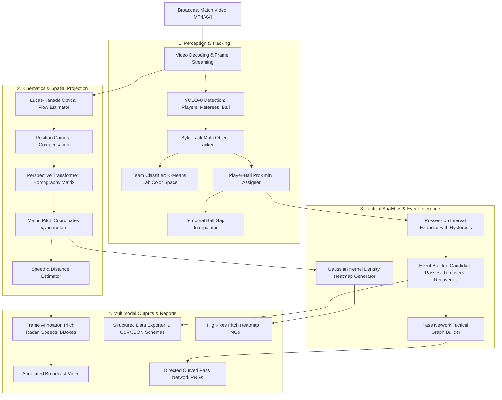
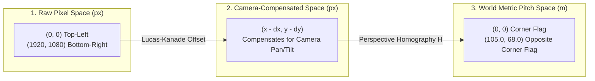
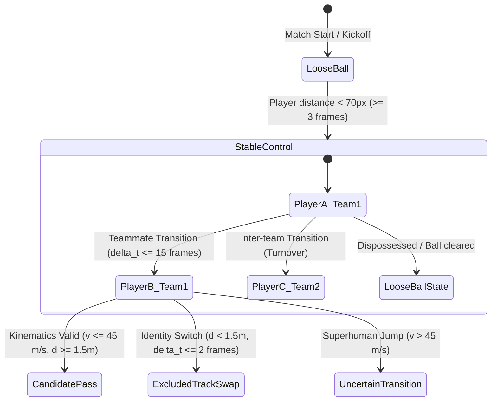

# System Architecture & Pipeline Design

A modular, production-ready computer vision and tactical sports analytics pipeline for broadcast football match footage.

---

## 1. High-Level Architecture

The `football-cv` pipeline processes raw broadcast video footage through three major computational phases:
1. **Perception & Tracking Layer**: Object detection, multi-object tracking, unsupervised team kit clustering, and ball assignment.
2. **Kinematic & Spatial Projection Layer**: Perimeter Lucas-Kanade optical flow camera motion compensation and four-point planar homography to real-world metric pitch coordinates (105.0m × 68.0m).
3. **Tactical Analytics & Diagnostics Layer**: Continuous possession interval segmentation, candidate pass network graph inference, spatial density heatmap aggregation, and defensive failure mode mitigations.

  

<b>📐 View Mermaid Flowchart Specification</b>

---

## 2. Stage-by-Stage Processing Lifecycle

| Stage | Module | Primary Class / Function | Input Data | Output Data |
| :--- | :--- | :--- | :--- | :--- |
| **1. Decoding** | `utils.video` | `read_video`, `stream_video` | Filepath `.mp4`/`.avi` | BGR NumPy frame sequence |
| **2. Detection & Tracking** | `tracking.tracker` | `Tracker.get_object_tracks` | BGR Frames | Raw bounding boxes `[x1, y1, x2, y2]` + Track IDs |
| **3. Camera Motion** | `camera_motion.estimator` | `CameraMotionEstimator` | Perimeter pixels ($0:20$, $900:1050$) | Frame-by-frame translation $(dx, dy)$ |
| **4. Team Classification** | `teams.classifier` | `TeamClassifier` | Player bounding box crops | Team ID ($1$ or $2$) via K-Means |
| **5. Ball Assignment** | `possession.assigner` | `PlayerBallAssigner` | Player & Ball centroids | Frame-level `has_ball` flag |
| **6. Ball Interpolation** | `possession.interpolation`| `BallInterpolator` | Frame-level ball positions | Continuous interpolated ball track |
| **7. Metric Projection** | `perspective.transformer` | `PerspectiveTransformer` | Pixel centroids + $4\times 2$ vertices | Pitch coordinates $(x, y)$ in meters |
| **8. Speed & Distance** | `movement.speed_distance`| `SpeedDistanceEstimator` | Metric pitch coordinates | Instantaneous speed (km/h) + total distance |
| **9. Event Inference** | `analytics.event_builder` | `EventBuilder` | Possession intervals + tracks | Candidate passes, turnovers, recoveries |
| **10. Multimodal Export** | `analytics.exporter` | `AnalyticsExporter` | Frame records + tactical events | 9 structured CSV/JSON datasets + Figures |

---

## 3. Coordinate Systems & Spatial Transformations

The pipeline operates simultaneously across three coordinate reference frames:

### 3.1. Planar Homography
A perspective transformation maps points on the video plane $(u, v)$ to the planar football pitch $(x, y)$:

$$\begin{bmatrix} x' \\ y' \\ w' \end{bmatrix} = \mathbf{H} \begin{bmatrix} u \\ v \\ 1 \end{bmatrix}, \quad x = \frac{x'}{w'}, \quad y = \frac{y'}{w'}$$

Where $\mathbf{H}$ is a $3 \times 3$ matrix calculated via `cv2.getPerspectiveTransform` using four known pitch landmarks:
* Bottom-left: $[110.0, 1035.0]$
* Top-left: $[265.0, 275.0]$
* Top-right: $[910.0, 260.0]$
* Bottom-right: $[1640.0, 915.0]$

---

## 4. Tactical Event Inference & State Machine

The transition between contiguous ball possession states is modeled as a discrete state machine:

---

## 5. Defensive Mitigations & Failure Resiliency

As established in Phase 10 ([`docs/error_analysis.md`](error_analysis.md)):
1. **Track-Swap False Pass Rejection**:
   $$\Delta t \le \frac{2}{\text{fps}} \quad \text{and} \quad \Delta d < 1.5\text{ m} \implies \text{reclassified as } \texttt{excluded}$$
2. **Superhuman Velocity Filter**:
   $$v = \frac{\Delta d}{\Delta t} > 45.0\text{ m/s} \implies \text{reclassified as } \texttt{uncertain\_transition}$$
3. **Possession Hysteresis Smoothing**:
   $$L_{\text{blip}} < 2\text{ frames} \implies \text{merged into continuous possession run}$$
4. **Camera Cut Discontinuity Reset**:
   $$\text{displacement} > 25.0\text{ px/frame} \implies \Delta \mathbf{x} = (0.0, 0.0), \quad \text{re-detect features}$$
