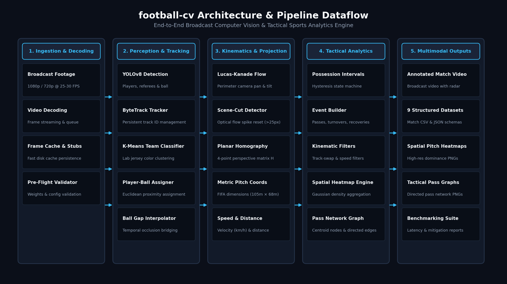
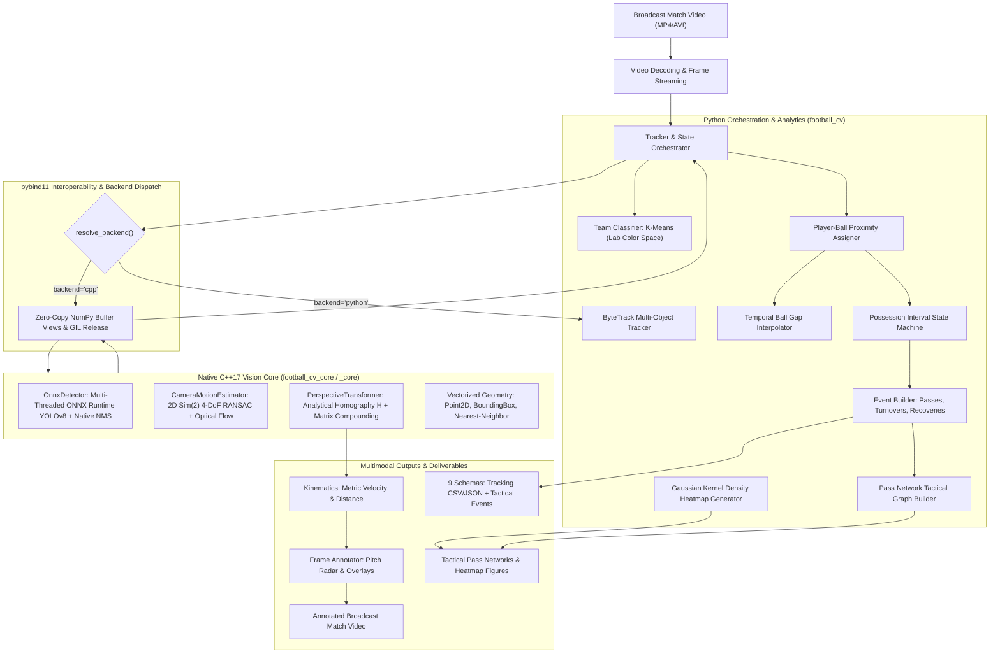
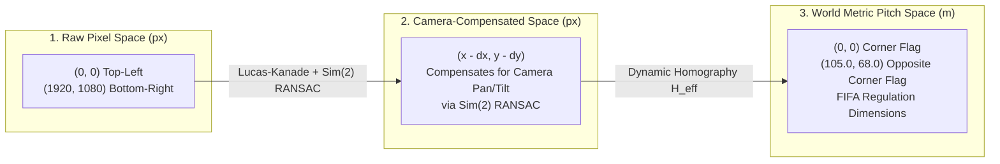
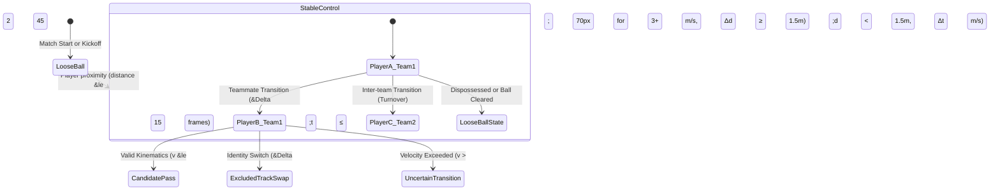

# System Architecture & Pipeline Design

A modular hybrid computer vision and tactical sports analytics engine for broadcast football match footage.

---

## 1. High-Level Architecture & Hybrid Engine Design

`football-cv` is engineered around a **hybrid ML systems architecture**:
* **Python Orchestration Layer (`football_cv`)**: Owns video stream decoding, tracking lifecycle orchestration, unsupervised K-Means kit clustering, continuous possession state machine tracking, and tactical graph modeling.
* **C++17 Vision Core (`football_cv_core` / `_core`)**: Owns performance-critical computational kernels: native ONNX Runtime YOLOv8 inference, 2D Affine Partial Sim(2) 4-DoF RANSAC camera motion estimation, analytical pitch homography solving, and vectorized bounding box geometry.
* **Zero-Copy Interoperability Bridge (`pybind11`)**: Direct memory mapping of contiguous NumPy arrays, GIL-scoped release (`py::gil_scoped_release`) for multi-threaded C++ execution, and unified dataclass conversions.
* **Dual-Backend Runtime Resolver (`resolve_backend`)**: Factory functions dynamically route requests to either native C++ adapters (`CppPerspectiveTransformerAdapter`, `CppCameraMotionEstimatorAdapter`) or pure-Python reference implementations, guaranteeing zero-crash fallback on systems without compiled C++ binaries.

<div align="center">
  
</div>

### Hybrid Systems Pipeline Architecture

```text
                   BROADCAST VIDEO INPUT
                             │
                             ▼
                  ┌─────────────────────┐
                  │ Video Decoding (CV2)│
                  └──────────┬──────────┘
                             │
                             ▼
            ┌─────────────────────────────────┐
            │  Unified Backend Resolver       │
            │  resolve_backend('python'|'cpp')│
            └────────────────┬────────────────┘
                             │
            ┌────────────────┴────────────────┐
            ▼                                 ▼
┌─────────────────────────┐       ┌─────────────────────────┐
│  Native C++ Vision Core │       │ Pure-Python Reference   │
│   (football_cv_core)    │       │     (Zero Dependency)   │
│ • ONNX Runtime Detector │       │ • Ultralytics YOLOv8    │
│ • 2D Sim(2) RANSAC      │       │ • OpenCV Optical Flow   │
│ • Analytical Homography │       │ • Scipy/Numpy Homography│
│ • Vectorized Geometry   │       │ • Native Math Fallback  │
└───────────┬─────────────┘       └───────────┬─────────────┘
            │                                 │
            └────────────────┬────────────────┘
                             │ (pybind11 Zero-Copy NumPy Views)
                             ▼
                  ┌─────────────────────┐
                  │ Multi-Object Track  │
                  │      ByteTrack      │
                  └──────────┬──────────┘
                             │
            ┌────────────────┴────────────────┐
            ▼                                 ▼
┌─────────────────────────┐       ┌─────────────────────────┐
│ Tactical Analytics      │       │ Dynamic Visualization   │
│ • Possession FSM        │       │ • Metric Pitch Radar    │
│ • Team Kit Clustering   │       │ • Annotated Video Render│
│ • Pass Network Graph    │       │ • High-Res PNG Heatmaps │
│ • 9 CSV/JSON Schemas    │       │ • Diagnostic Reports    │
└─────────────────────────┘       └─────────────────────────┘
```

<details>
<summary><b>📐 View Detailed Flowchart Specification (Mermaid)</b></summary>


```mermaid
flowchart TD
    VideoInput["Broadcast Match Video (MP4/AVI)"] --> Decoder["Video Decoding & Frame Streaming"]
    
    subgraph PythonLayer ["Python Orchestration & Analytics (football_cv)"]
        TrackerOrchestrator["Tracker & State Orchestrator"]
        ByteTrack["ByteTrack Multi-Object Tracker"]
        TeamClustering["Team Classifier: K-Means (Lab Color Space)"]
        BallAssigner["Player-Ball Proximity Assigner"]
        BallInterpolation["Temporal Ball Gap Interpolator"]
        IntervalExtractor["Possession Interval State Machine"]
        EventBuilder["Event Builder: Passes, Turnovers, Recoveries"]
        PassNetworkGen["Pass Network Tactical Graph Builder"]
        HeatmapGen["Gaussian Kernel Density Heatmap Generator"]
    end

    subgraph NativeBridge ["pybind11 Interoperability & Backend Dispatch"]
        BackendResolver{"resolve_backend()"}
        ZeroCopy["Zero-Copy NumPy Buffer Views & GIL Release"]
    end

    subgraph NativeCppCore ["Native C++17 Vision Core (football_cv_core / _core)"]
        OnnxEngine["OnnxDetector: Multi-Threaded ONNX Runtime YOLOv8 + Native NMS"]
        RansacEngine["CameraMotionEstimator: 2D Sim(2) 4-DoF RANSAC + Optical Flow"]
        HomographyEngine["PerspectiveTransformer: Analytical Homography H + Matrix Compounding"]
        GeometryEngine["Vectorized Geometry: Point2D, BoundingBox, Nearest-Neighbor"]
    end

    subgraph Outputs ["Multimodal Outputs & Deliverables"]
        SpeedDist["Kinematics: Metric Velocity & Distance"]
        Annotator["Frame Annotator: Pitch Radar & Overlays"]
        AnnotatedVideo["Annotated Broadcast Match Video"]
        StructuredData["9 Schemas: Tracking CSV/JSON + Tactical Events"]
        ReportPlots["Tactical Pass Networks & Heatmap Figures"]
    end

    Decoder --> TrackerOrchestrator
    TrackerOrchestrator --> BackendResolver
    BackendResolver -->|"backend='cpp'"| ZeroCopy
    ZeroCopy --> NativeCppCore
    BackendResolver -->|"backend='python'"| ByteTrack

    NativeCppCore --> ZeroCopy
    ZeroCopy --> TrackerOrchestrator
    TrackerOrchestrator --> TeamClustering
    TrackerOrchestrator --> BallAssigner
    BallAssigner --> BallInterpolation
    BallAssigner --> IntervalExtractor
    IntervalExtractor --> EventBuilder
    EventBuilder --> PassNetworkGen
    HomographyEngine --> SpeedDist
    SpeedDist --> Annotator
    Annotator --> AnnotatedVideo
    EventBuilder --> StructuredData
    HeatmapGen --> ReportPlots
    PassNetworkGen --> ReportPlots
```

</details>

---

## 2. Stage-by-Stage Processing Lifecycle

| Stage | Subsystem | Python Class | Native C++ Implementation | Output Representation |
| :--- | :--- | :--- | :--- | :--- |
| **1. Decoding** | Video I/O | `utils.video.VideoStreamReader` | OpenCV C++ Backend | BGR Frame sequence ($H \times W \times 3$) |
| **2. Detection** | Object Perception | `tracking.detector.ObjectDetector` | `football_cv::OnnxDetector` | Bounding boxes `[x1, y1, x2, y2]`, confidences, class IDs |
| **3. Tracking** | Multi-Object Tracking | `tracking.tracker.ObjectTracker` | ByteTrack Association | Persistent player/referee/ball Track IDs |
| **4. Camera Motion** | Motion Stabilization | `camera_motion.CameraMotionEstimator` | `football_cv::CameraMotionEstimator` | Inter-frame translation $(dx, dy)$ & 2D Sim(2) affine matrix |
| **5. Team Kits** | Color Clustering | `teams.classifier.TeamClassifier` | Scikit-learn K-Means in Lab space | Binary team association (`team_id \in {1, 2}`) |
| **6. Ball Proximity** | Ball Assignment | `possession.assigner.PlayerBallAssigner` | Vectorized Nearest Neighbor | Frame-level `has_ball` assignment |
| **7. Interpolation** | Occlusion Bridging | `possession.interpolation.BallInterpolator` | Linear / Polynomial interpolation | Continuous ball trajectory |
| **8. Homography** | Metric Pitch Mapping | `perspective.transformer.PerspectiveTransformer`| `football_cv::PerspectiveTransformer` | Calibrated pitch coordinates $(x, y)$ in meters |
| **9. Kinematics** | Speed & Distance | `movement.speed_distance.SpeedDistanceEstimator`| Vectorized Kinematics | Real-world velocity (km/h) & cumulative distance (m) |
| **10. Tactical Events** | Event Inference | `analytics.event_builder.EventBuilder` | State Machine with Hysteresis | Passes, turnovers, recoveries, possession runs |
| **11. Visualizations** | Radar & Heatmaps | `rendering.annotations.FrameAnnotator` | Matplotlib / OpenCV Graphics | Annotated MP4/AVI & 2D Tactical Pitch Radar |
| **12. Multimodal Export**| Structured Telemetry | `analytics.exporter.AnalyticsExporter` | Streaming CSV / JSON Schemas | 9 structured match datasets |

---

## 3. Coordinate Systems & Spatial Transformations

The pipeline models spatial positions across three reference coordinate frames:

```text
┌────────────────────────┐         ┌────────────────────────┐         ┌────────────────────────┐
│  1. Raw Pixel Space    │         │ 2. Camera-Compensated  │         │  3. World Metric Pitch │
│   (0, 0) -> (1920,1080)│ ──────> │    (x - dx, y - dy)    │ ──────> │  (0, 0) -> (105m, 68m) │
│   Raw broadcast video  │ LK+RANSAC│ Pan/tilt compensation  │  H_eff  │ Real-world FIFA coords │
└────────────────────────┘         └────────────────────────┘         └────────────────────────┘
```

<details>
<summary><b>📐 View Coordinate Transformation Graph (Mermaid)</b></summary>


```mermaid
graph LR
    subgraph ImageSpace ["1. Raw Pixel Space (px)"]
        A["(0, 0) Top-Left<br/>(1920, 1080) Bottom-Right"]
    end

    subgraph StabilizedSpace ["2. Camera-Compensated Space (px)"]
        B["(x - dx, y - dy)<br/>Compensates for Camera Pan/Tilt<br/>via Sim(2) RANSAC"]
    end

    subgraph PitchSpace ["3. World Metric Pitch Space (m)"]
        C["(0, 0) Corner Flag<br/>(105.0, 68.0) Opposite Corner Flag<br/>FIFA Regulation Dimensions"]
    end

    A -->|"Lucas-Kanade + Sim(2) RANSAC"| B
    B -->|"Dynamic Homography H_eff"| C
```

</details>

### 3.1. Planar Homography & Analytical Solving
A projective transformation maps image plane coordinates $(u, v)$ to the planar football pitch $(x, y)$:

$$\begin{bmatrix} x' \\ y' \\ w' \end{bmatrix} = \mathbf{H} \begin{bmatrix} u \\ v \\ 1 \end{bmatrix}, \quad x = \frac{x'}{w'}, \quad y = \frac{y'}{w'}$$

In `football_cv::PerspectiveTransformer`, $\mathbf{H}$ is solved analytically from 4 reference broadcast landmarks via an $8 \times 8$ linear system with normalized scale $H_{22} = 1.0$:
* Bottom-left: $[110.0, 1035.0]$
* Top-left: $[265.0, 275.0]$
* Top-right: $[910.0, 260.0]$
* Bottom-right: $[1640.0, 915.0]$

### 3.2. Dynamic Camera Matrix Compounding
When camera pan and tilt movements occur, the effective homography matrix $H_{\text{eff}}$ compounds the static homography $H_{0 \to \text{pitch}}$ with the inter-frame camera transformation $H_{t \to 0}$:

$$\mathbf{H}_{\text{eff}} = \mathbf{H}_{0 \to \text{pitch}} \cdot \mathbf{H}_{t \to 0}$$

This ensures metric coordinate stability even during fast broadcast sweeps. Horizon singularities ($w' \le 10^{-6}$) and off-pitch projections are managed through three configurable out-of-bounds policies: `Strict` (discard), `Clip` (clamp to pitch court), and `Extrapolate` (allow unbounded projections).

---

## 4. Tactical Event Inference & State Machine

Continuous ball possession and candidate transition events are evaluated via a discrete finite state machine:

```text
                         [ Match Start / Kickoff ]
                                     │
                                     ▼
                              ┌─────────────┐
                              │  LooseBall  │
                              └──────┬──────┘
                                     │ Player proximity (dist <= 70px for 3+ frames)
                                     ▼
                    ┌─────────────────────────────────┐
                    │          StableControl          │
                    │                                 │
                    │  ┌───────────────┐              │
                    │  │ PlayerA_Team1 │              │
                    │  └───────┬───────┘              │
                    │          │                      │
                    │          ├──────────────────────┼─────────────> [ PlayerC_Team2 (Turnover) ]
                    │          │                      │
                    │          ▼                      │
                    │  ┌───────────────┐              │
                    │  │ PlayerB_Team1 │              │
                    │  └───────┬───────┘              │
                    └──────────┼──────────────────────┘
                               │
            ┌──────────────────┼──────────────────┐
            │                  │                  │
            │ Valid Kinematics │ Track Swap Blip  │ Superhuman Spike
            │ (v <= 45 m/s)    │ (d < 1.5m)       │ (v > 45 m/s)
            ▼                  ▼                  ▼
     ┌─────────────┐    ┌─────────────┐    ┌─────────────────────┐
     │CandidatePass│    │ExcludedSwap │    │UncertainTransition  │
     └─────────────┘    └─────────────┘    └─────────────────────┘
```

<details>
<summary><b>📐 View State Transition Specification (Mermaid)</b></summary>


```mermaid
stateDiagram-v2
    [*] --> LooseBall : Match Start or Kickoff
    LooseBall --> StableControl : Player proximity (distance &le; 70px for 3+ frames)
    
    state StableControl {
        [*] --> PlayerA_Team1
        PlayerA_Team1 --> PlayerB_Team1 : Teammate Transition (&Delta;t &le; 15 frames)
        PlayerA_Team1 --> PlayerC_Team2 : Inter-team Transition (Turnover)
        PlayerA_Team1 --> LooseBallState : Dispossessed or Ball Cleared
    }

    PlayerB_Team1 --> CandidatePass : Valid Kinematics (v &le; 45 m/s, &Delta;d &ge; 1.5m)
    PlayerB_Team1 --> ExcludedTrackSwap : Identity Switch (&Delta;d &lt; 1.5m, &Delta;t &le; 2 frames)
    PlayerB_Team1 --> UncertainTransition : Velocity Exceeded (v &gt; 45 m/s)
```

</details>

---

## 5. Defensive Mitigations & Failure Resiliency

Evaluated and verified through the reproducible diagnostic suite (`football-cv error-analysis`):
1. **Track-Swap False Pass Rejection**:
   $$\Delta t \le \frac{2}{\text{fps}} \quad \text{and} \quad \Delta d < 1.5\text{ m} \implies \text{reclassified as } \texttt{excluded}$$
2. **Superhuman Velocity Filter**:
   $$v = \frac{\Delta d}{\Delta t} > 45.0\text{ m/s} \implies \text{reclassified as } \texttt{uncertain\_transition}$$
3. **Possession Hysteresis Smoothing**:
   $$L_{\text{blip}} < 2\text{ frames} \implies \text{merged into continuous possession run}$$
4. **Camera Cut Discontinuity Reset**:
   $$\text{displacement} > 25.0\text{ px/frame} \implies \Delta \mathbf{x} = (0.0, 0.0), \quad \text{re-detect features}$$
5. **Ball Occlusion Gap Bridging**:
   $$\Delta t_{\text{missing}} \le 2\text{ frames} \implies \text{interpolated without breaking possession continuity}$$
